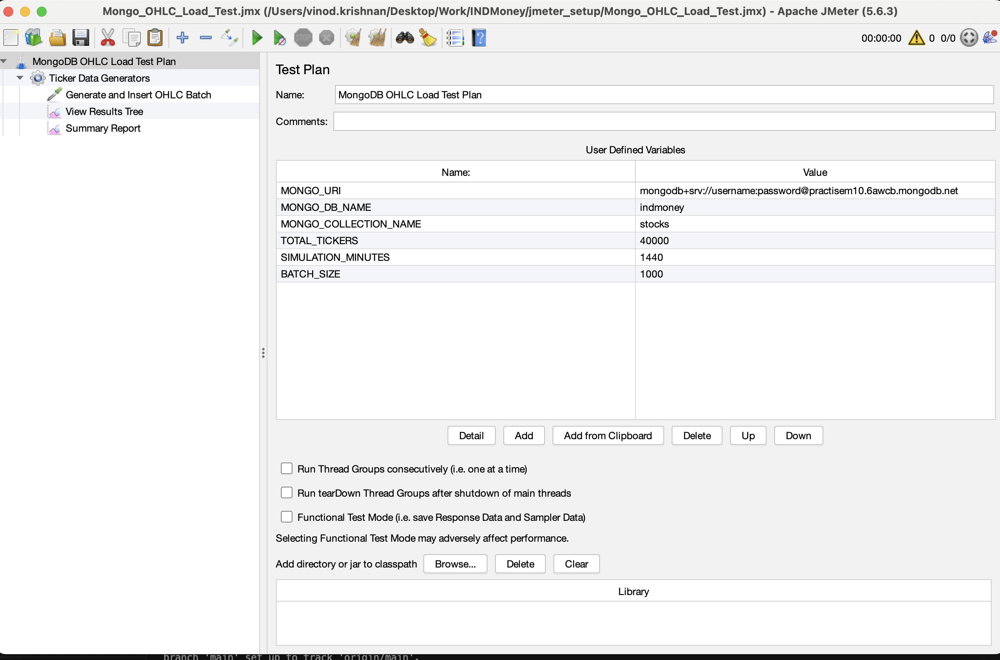

# JMeter Performance Testing Setup on AWS EC2

This guide provides a step-by-step walkthrough for setting up a performance testing environment using Apache JMeter on an AWS EC2 instance. This setup is tailored for testing with MongoDB and includes a custom virtual thread group plugin.

---

## 1. AWS EC2 Instance Setup

Ensure you have an AWS EC2 instance with any specifications I took below for stress testing Atlas:

* **Instance Type**: `c6g.8xLarge`
* **Storage**: 100 GB (gp3)
* **CPU Arch**: ARM
* **OS**: Amazon Linux 2023

---

## 2. Environment Preparation

Connect to your EC2 instance and run the following commands to update system packages and install Java.

```bash
# Update the package manager
sudo dnf update -y

# Install Amazon Corretto 21 (Java 21)
sudo dnf install java-21-amazon-corretto -y
```
---
## 3. Apache JMeter Installation

### 3.1. Download and Extract JMeter
```
# Navigate to the /opt directory
cd /opt

# Download Apache JMeter v5.6.3
sudo wget [https://archive.apache.org/dist/jmeter/binaries/apache-jmeter-5.6.3.tgz](https://archive.apache.org/dist/jmeter/binaries/apache-jmeter-5.6.3.tgz)

# Extract the archive
sudo tar -xvf apache-jmeter-5.6.3.tgz

# Remove the downloaded archive
sudo rm apache-jmeter-5.6.3.tgz
```

### 3.2. Set Environment Variables
```
Create a system-wide profile script to set JMeter environment variables.
# Create and populate the jmeter.sh script
sudo tee /etc/profile.d/jmeter.sh > /dev/null <<'EOF'
export JMETER_HOME=/opt/apache-jmeter-5.6.3
export PATH=$JMETER_HOME/bin:$PATH
EOF

# Make the script executable
sudo chmod +x /etc/profile.d/jmeter.sh

# Load the new variables
source /etc/profile.d/jmeter.sh

# Verify the installation
jmeter -v
```

## 4. JMeter Plugin and Driver Configuration

### 4.1. Required JAR Files

### You will need the following JAR files - download from Repo [here](https://github.com/vinodkrishnan23/jmeter/tree/main/jar):
```
virtual-thread-group-plugin-1.0-SNAPSHOT.jar

mongodb-driver-sync-5.5.1.jar

mongodb-driver-core-5.5.1.jar

bson-5.5.1.jar
```
### 4.2. Install Custom JARs

```
#First, remove the old MongoDB driver.

sudo rm -f /opt/apache-jmeter-5.6.3/lib/mongo-java-driver-2.14.3.jar

#Next, copy the required JAR files from your local machine to the EC2 instance. Replace the placeholder values for the PEM key and EC2 instance details.
# Sample scp commands modify per your own setup
scp -i YOUR_EC2_PEM_FILE ./bson-5.5.1.jar ec2-user@<EC2_PUBLIC_IP>:/home/ec2-user
scp -i YOUR_EC2_PEM_FILE ./mongodb-driver-core-5.5.1.jar ec2-user@<EC2_PUBLIC_IP>:/home/ec2-user
scp -i YOUR_EC2_PEM_FILE ./mongodb-driver-sync-5.5.1.jar ec2-user@<EC2_PUBLIC_IP>:/home/ec2-user
scp -i YOUR_EC2_PEM_FILE ./virtual-thread-group-plugin-1.0-SNAPSHOT.jar ec2-user@<EC2_PUBLIC_IP>:/home/ec2-user

# Finally, move the JARs to the JMeter lib/ext directory.

# Move JARs from the home directory to the JMeter lib/ext directory
sudo cp /home/ec2-user/*.jar /opt/apache-jmeter-5.6.3/lib/ext/

```

## 5. Performance Tuning
### Configure the Java Heap size for JMeter by adding the following to your ~/.bashrc file.

```
echo "export HEAP='-Xms30g -Xmx45g -XX:MaxMetaspaceSize=1g'" >> ~/.bashrc
source ~/.bashrc
# Note: Adjust the heap size values based on your EC2 instance's available memory.
```

## 6. Installing Apache JMeter on Local MAC

Follow these steps to set up **Apache JMeter** on your local machine (Mac/Linux/Windows).  

---

### 6.1 Install Java (Prerequisite)
JMeter requires **Java 8 or later**.

### 6.2 Check Java
```bash
java -version
```
---

### 6.3 Install Java - Mac (Homebrew)
```
brew install openjdk@17
```

### 6.4 Download jmeter
```
wget https://downloads.apache.org/jmeter/binaries/apache-jmeter-5.6.3.tgz
```

### 6.5 Extract the Archive
```
tar -xvzf apache-jmeter-5.6.3.tgz
mv apache-jmeter-5.6.3 ~/jmeter
```

### 6.6 Set Environment Variables
```
# Add below lines in ~/.zshrc
export JMETER_HOME=~/jmeter
export PATH=$JMETER_HOME/bin:$PATH

source ~/.zshrc
```
### 6.7 Run JMeter
```
# GUI Mode (for designing test plans):
jmeter
```
### 6.8 Create JMX plan from the UI-  Sample JMX can be found [here](https://github.com/vinodkrishnan23/jmeter/tree/main/sample_jmx), These can be imported into jmeter GUI

## 7. Running a JMeter Test on EC2 Instance
### 7.1.1 Method I - Create a Test Script (run_JMX.sh) with a separate config File

```
Create a shell script named run_JMX.sh with the following content.
#!/bin/bash

set -e

testNum="$1"
TARGET_DIR="$PWD/$1"

if [ ! -d "$TARGET_DIR" ]; then
    echo "Directory does not exist: $TARGET_DIR. Please create it and add a config.json file."
    exit 1
fi

echo "Running test number: $testNum"

jmeter -n \
       -t "$TARGET_DIR/test_plan.jmx" \
       -l "$TARGET_DIR/results.jtl" \
       -j "$TARGET_DIR/jmeter.log" \
       -e -o "$TARGET_DIR/dashboard"

echo "Test $testNum completed. Dashboard report generated in $TARGET_DIR/dashboard."

```

### 7.1.2 Method I -  Execute the Test with a separate config File - sample [here](https://github.com/vinodkrishnan23/jmeter/tree/main/sample_config)
```
Create your JMeter test plan and save it as test_plan.jmx.

Create a directory for your test run (e.g., mkdir test_01).

Place test_plan.jmx and any other necessary files such as config file inside this directory.

Copy the directory to your EC2 instance.

Make the run_JMX.sh script executable: 

chmod +x run_JMX.sh.

Run the test:

./run_JMX.sh test_01
```

### 7.2.1. Method II - Passing parameter at overall TestPlan Level via jmeter UI

### 7.2.2. Method II - Execute the test

```
Create your JMeter test plan and save it as test_plan.jmx.

Place test_plan.jmx on your ec2 instance home directory

Run the test

jmeter -n -t ./test_plan.jmx -l ./results.csv -e -o ./dashboard_report

```